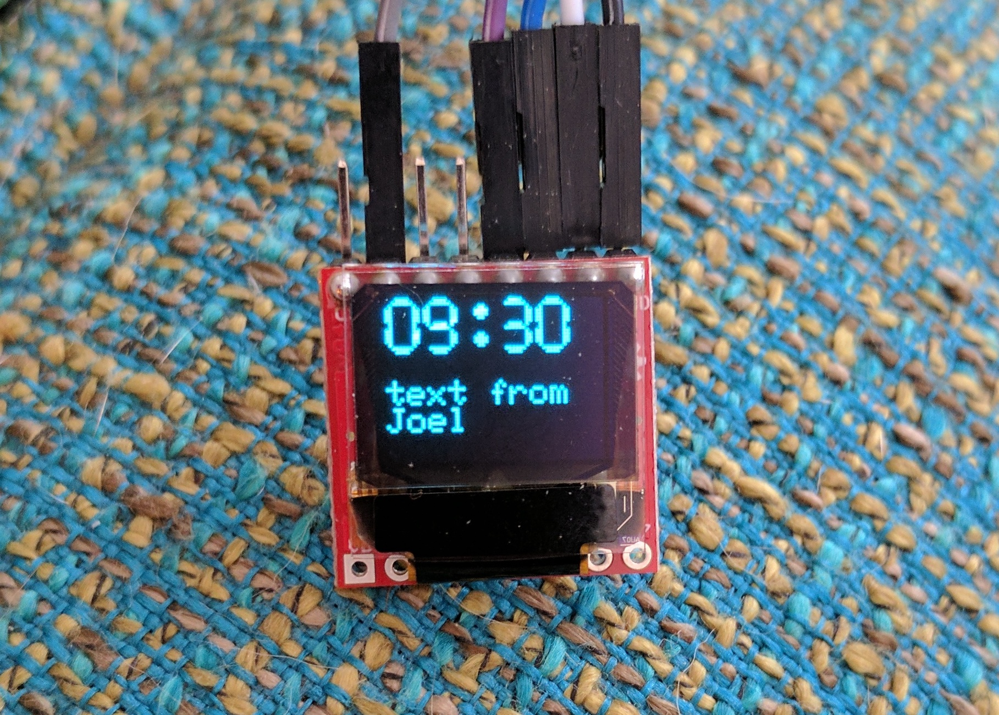

# OpenHAK 64x48 OLED Display Library

This library is based on Sparkfun Micro OLED Arduino Library. It has been modified to work with the OpenHAK Beta hardware, which targets a Simlbee radio module and uses I2C.  
Modifications made by Joel Murphy/Biomurph Summer, 2017. 
  
What follows is mostly from the original Sparkfun README 

*************************

### OpenHAK Micro OLED Breakout Arduino Library

[*SparkFun Micro OLED Breakout (LCD-13003)*](https://www.sparkfun.com/products/13003)

An Arduino library that allows you to draw shapes and text on the Micro OLED display.

Documentation
--------------

* **[Installing an Arduino Library Guide](https://learn.sparkfun.com/tutorials/installing-an-arduino-library)** - Basic information on how to install an Arduino library.
* **[Product Repository](https://github.com/sparkfun/Micro_OLED_Breakout)** - Main repository (including hardware files) for the Micro OLED Breakout.
* **[Hookup Guide](https://learn.sparkfun.com/tutorials/micro-oled-breakout-hookup-guide)** - Basic hookup guide for the Micro OLED Breakout.

**This library was modified by Joel Murphy, Spring 2017. It specifically targets the Simblee radio module on the OpenHAK fitness tracker.**

SparkFun Products that use this Library
---------------------------------

* [Micro OLED Breakout](https://www.sparkfun.com/products/13003)- A breakout for the monochrome 64x48 OLED.

License Information
-------------------

This product is _**open source**_!

The **code** is released under the GPL v3 license. See the included LICENSE.md for more information.

Distributed as-is; no warranty is given.

- Your friends at SparkFun and OpenHAK.
